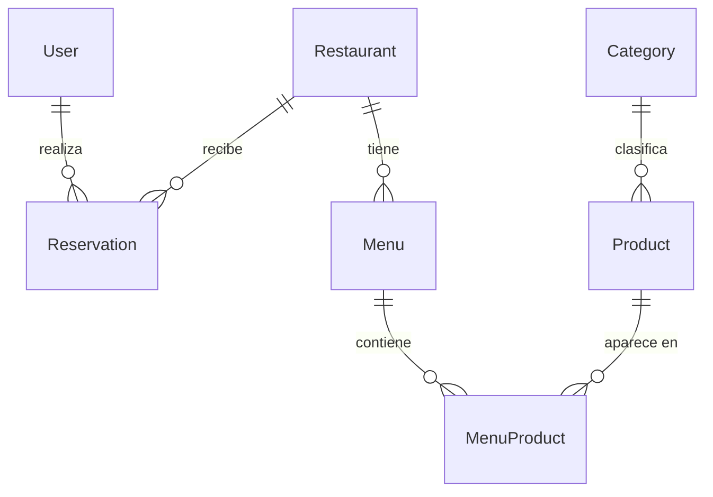
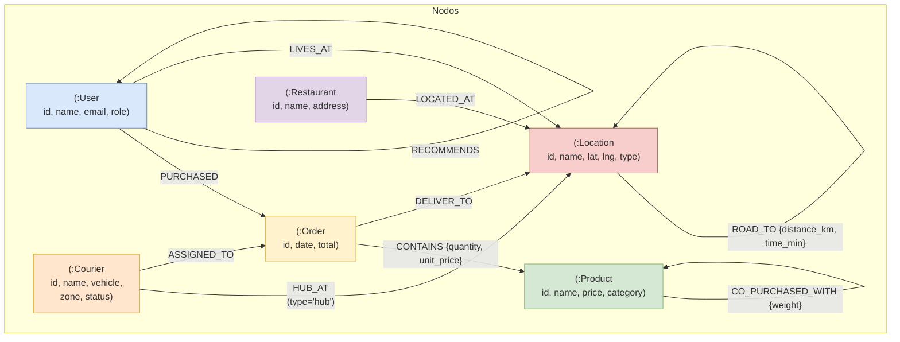

# PY01 Restaurantes — Microservicios con Persistencia Políglota

**Repo**: https://github.com/JoseJimenez01/Analysis-Process_OLAP#
**Swagger UI**: http://localhost/api/docs (después de desplegar)

> Sistema de restaurantes con arquitectura de microservicios, persistencia políglota (PostgreSQL ↔ MongoDB), MongoDB Sharded Cluster, Elasticsearch, Redis y escalabilidad horizontal con Kubernetes.

---

## Índice

1. [Requisitos](#1-requisitos)
2. [Despliegue Completo](#2-despliegue-completo)
3. [Carga de Datos Ficticios (Seed)](#3-carga-de-datos-ficticios-seed)
4. [Cambiar Motor de Base de Datos](#4-cambiar-motor-de-base-de-datos)
5. [Pipeline ETL (Airflow)](#5-pipeline-etl-airflow)
6. [Escalabilidad Horizontal (Kubernetes)](#6-escalabilidad-horizontal-kubernetes)
7. [Modelos de Datos](#7-modelos-de-datos)
8. [Pruebas](#8-pruebas)
9. [Endpoints Principales](#9-endpoints-principales)
10. [Comandos Útiles](#10-comandos-utiles)

---

## 1. Requisitos

| Requisito | Mínimo |
|-----------|--------|
| Docker Desktop | 20.10+ (con Docker Compose v2) |
| RAM disponible | **8 GB** (el cluster sharded usa ~4 GB) |
| Node.js | 22+ (solo para desarrollo local sin Docker) |
| Kubernetes | Docker Desktop con K8s habilitado (solo para sección 6) |

---

## 2. Despliegue Completo

### 2.1 — Clonar y levantar

```bash
git clone https://github.com/JoseJimenez01/Analysis-Process_OLAP.git
cd proy1-bd2-restaurantes
docker compose up --build -d
```

> **Primera vez**: ~2-3 minutos (descarga de imágenes + build).
> El stack incluye: PostgreSQL, MongoDB Sharded Cluster (9 nodos + Mongos + 3 init containers), Redis, Elasticsearch, Hive, Spark, Airflow, Superset, Neo4j, 2 microservicios y Nginx.

### 2.2 — Verificar que todo esté corriendo

```bash
docker compose ps
```

- Servicios principales -> estado `Up (healthy)`
- Init containers (`configsvr-setup`, `shards-setup`, `sharding-setup`, `hive-schema-init`) -> `Exited (0)` (es normal, son one-shot)

### 2.3 — Verificar acceso

```bash
curl http://localhost/api/health

# Swagger UI (abrir en navegador)
http://localhost/api/docs
```

Respuesta esperada del health check:
```json
{
  "status": "ok",
  "services": {
    "postgres": { "status": "up" },
    "mongo": { "status": "up" },
    "redis": { "status": "up" }
  }
}
```

---

## 3. Carga de Datos Ficticios (Seed)

Con la infraestructura levantada:

```bash
docker compose exec -w /app/services/api api node ../../infra/scripts/seed-data.js
```

> **Por que `-w /app/services/api`?** El script reutiliza `db.js` del API, que necesita resolver `@prisma/adapter-pg` instalado en el workspace del servicio.

### Datos que se insertan

| Entidad | Cantidad | Detalle |
|---------|----------|---------|
| Categorias | 16 | Entradas, Platos Fuertes, Pastas, Mariscos, etc. |
| Restaurantes | 30 | Establecimientos guatemaltecos ficticios |
| Productos | 1200 | Platos y bebidas con precios y descripciones |
| Usuarios | 1500 | 1 admin + 1499 customers |
| Menus | 111 | Distribuidos entre los restaurantes |
| Reservaciones | 2500 | Diferentes estados (pending, confirmed, etc.) |

### Verificacion rapida

```bash
curl http://localhost/api/restaurants
curl http://localhost/api/products
curl http://localhost/api/categories
```

---

## 4. Cambiar Motor de Base de Datos

El sistema usa el **Patron Repository** para abstraer la persistencia. El cambio es **solo una variable de entorno**:

```bash
# 1. Editar .env
DB_ENGINE=mongodb    # Opciones: postgres (default) | mongodb

# 2. Recrear stack desde cero
docker compose down -v
docker compose up --build -d

# 3. Cargar seed en MongoDB
docker compose exec -w /app/services/api api node ../../infra/scripts/seed-data.js
```

> El flag `-v` elimina todos los volumenes (datos de PostgreSQL, MongoDB, Elasticsearch). Es necesario al cambiar de motor.

### 4.1 — Analisis con Neo4j (Grafo de Productos, Usuarios y Rutas)

El módulo Neo4j consta de dos sub-módulos:
- **`graphs_and_routes/`** — Grafo base con usuarios, productos, pedidos, ubicaciones y una red vial. Consultas de co-compra, recomendaciones y rutas cortas.
- **`delivery_routes/`** — Simulador de rutas de reparto con couriers, que extiende el grafo base. Optimización nearest-neighbour usando `shortestPath` en Cypher puro (sin GDS/APOC).

#### Acceso a Neo4j

Neo4j corre en los puertos:
- **Browser UI**: http://localhost:7474 (cred: `neo4j`/`password`)
- **Cypher shell**: `docker exec -it py01_neo4j cypher-shell -u neo4j -p password`

#### Visualizar el grafo (Browser UI)

Para explorar visualmente los nodos y relaciones:

1. Abrir http://localhost:7474 e iniciar sesión (`neo4j` / `password`)
2. En el panel _Browser_, ingresar una de estas consultas y presionar `Ctrl+Enter`:

```cypher
// Ver todos los nodos (máx 25)
MATCH (n) RETURN n LIMIT 25;

// Ver el grafo completo de usuarios, pedidos y productos
MATCH (u:User)-[:PURCHASED]->(o:Order)-[:CONTAINS]->(p:Product)
RETURN u, o, p LIMIT 50;

// Ver la red vial con ubicaciones
MATCH (l:Location)-[:ROAD_TO]->(m:Location)
RETURN l, m LIMIT 30;

// Ver el modelo completo: couriers, hubs y rutas de entrega
MATCH (c:Courier)-[:HUB_AT]->(hub:Location),
      (c)-[:ASSIGNED_TO]->(o:Order)-[:DELIVER_TO]->(dest:Location)
RETURN c, hub, o, dest LIMIT 50;
```

Cada nodo se visualiza como un círculo etiquetado; las aristas muestran el tipo de relación. Se puede hacer clic en un nodo para expandir sus conexiones (_Expand_) o seleccionar un grupo con _Select_ para inspeccionar propiedades.

También se puede prender el modo _Auto-complete_ en la barra del editor para que el Browser sugiera consultas basadas en los labels del grafo cargado.

#### 4.1.1 — Crear el schema (constraints)

Cada sub-módulo tiene su propio archivo `schema.cypher` que define las constraints de unicidad. Deben ejecutarse antes de cargar datos:

```bash
# Schema del grafo base
docker exec -i py01_neo4j cypher-shell -u neo4j -p password \
  < analytics/using_neo4j/graphs_and_routes/schema.cypher

# Schema de delivery routes (extiende el grafo base)
docker exec -i py01_neo4j cypher-shell -u neo4j -p password \
  < analytics/using_neo4j/delivery_routes/schema.cypher
```

#### 4.1.2 — Cargar datos

Hay dos formas de cargar datos, según lo que se necesite:

**Opción A — Carga completa con seed + ETL desde PostgreSQL/MongoDB**

Usa los scripts Python desde el contenedor `py01_airflow`, que tiene las dependencias necesarias (`neo4j`, `psycopg2`, `pymongo`). Conecta directo a las bases de datos del stack para extraer datos reales de usuarios, productos y reservaciones:

```bash
# Cargar grafo base — schema + seed + ETL desde PostgreSQL
docker exec py01_airflow \
  env NEO4J_URI=bolt://py01_neo4j:7687 NEO4J_USER=neo4j NEO4J_PASSWORD=password \
      PG_HOST=py01_postgres PG_USER=postgres PG_PASSWORD=postgres PG_DB=restaurantes \
  python3 /opt/airflow/using_neo4j/graphs_and_routes/load_data.py --reset

# Cargar delivery routes — schema + seed + routing
docker exec py01_airflow \
  env NEO4J_URI=bolt://py01_neo4j:7687 NEO4J_USER=neo4j NEO4J_PASSWORD=password \
  python3 /opt/airflow/using_neo4j/delivery_routes/load_data.py --reset
```

> **Nota sobre ETL desde PostgreSQL/MongoDB**: Si solo se necesita el seed (datos de ejemplo autocontenidos), añadir `--seed-only` para saltar la conexión a las bases de datos.

**Opción B — Solo seed via cypher-shell (datos de ejemplo)**

Los archivos `.cypher` contienen datos de ejemplo completos con IDs consistentes (9 usuarios, 15 productos, 21 pedidos, 14 ubicaciones, 3 restaurantes, 3 couriers). Ejecutar en orden:

```bash
# 1. Schema del grafo base
docker exec -i py01_neo4j cypher-shell -u neo4j -p password \
  < analytics/using_neo4j/graphs_and_routes/schema.cypher

# 2. Seed del grafo base
docker exec -i py01_neo4j cypher-shell -u neo4j -p password \
  < analytics/using_neo4j/graphs_and_routes/seed.cypher

# 3. Schema de delivery routes
docker exec -i py01_neo4j cypher-shell -u neo4j -p password \
  < analytics/using_neo4j/delivery_routes/schema.cypher

# 4. Seed de delivery routes
docker exec -i py01_neo4j cypher-shell -u neo4j -p password \
  < analytics/using_neo4j/delivery_routes/seed.cypher

# 5. (Opcional) Computar relaciones de co-compra
docker exec -i py01_neo4j cypher-shell -u neo4j -p password \
  "MATCH (o:Order)-[:CONTAINS]->(p1:Product), (o)-[:CONTAINS]->(p2:Product) WHERE p1 <> p2 WITH p1, p2, count(DISTINCT o) AS freq MERGE (p1)-[:CO_PURCHASED_WITH {weight: freq}]->(p2) MERGE (p2)-[:CO_PURCHASED_WITH {weight: freq}]->(p1)"
```

> La Opción B carga datos autocontenidos sin depender de PostgreSQL/MongoDB, ideal para demostraciones.

#### 4.1.3 — Ejecutar consultas Cypher

Las consultas están definidas en los archivos `queries.cypher` de cada sub-módulo. Para ejecutarlas hay dos formas:

**Desde Browser UI** (recomendado para exploración visual):
1. Abrir http://localhost:7474
2. Login con `neo4j` / `password`
3. Copiar y pegar las consultas desde los archivos `.cypher`

**Desde línea de comandos**:
```bash
# Ejecutar todo el archivo queries.cypher
docker exec -i py01_neo4j cypher-shell -u neo4j -p password \
  < analytics/using_neo4j/graphs_and_routes/queries.cypher

# Ejecutar delivery routes queries
docker exec -i py01_neo4j cypher-shell -u neo4j -p password \
  < analytics/using_neo4j/delivery_routes/queries.cypher
```

O ejecutar una consulta específica inline:
```bash
docker exec -i py01_neo4j cypher-shell -u neo4j -p password \
  "MATCH (p1:Product)-[r:CO_PURCHASED_WITH]->(p2:Product) RETURN p1.name, p2.name, r.weight ORDER BY r.weight DESC LIMIT 5;"
```

#### Archivos de referencia

| Archivo | Contenido |
|---------|-----------|
| `analytics/using_neo4j/graphs_and_routes/schema.cypher` | Constraints del grafo base (User, Product, Order, Location, Restaurant) |
| `analytics/using_neo4j/graphs_and_routes/seed.cypher` | Datos de ejemplo (9 users, 15 products, 9 orders, 11 locations, road network) |
| `analytics/using_neo4j/graphs_and_routes/queries.cypher` | Consultas: co-purchases, recomendaciones, rutas cortas (Q1–Q3) |
| `analytics/using_neo4j/graphs_and_routes/load_data.py` | ETL desde PostgreSQL/MongoDB a Neo4j |
| `analytics/using_neo4j/delivery_routes/schema.cypher` | Extensión con Courier nodes |
| `analytics/using_neo4j/delivery_routes/seed.cypher` | Datos de delivery (3 couriers, 12 orders de simulacion) |
| `analytics/using_neo4j/delivery_routes/queries.cypher` | Rutas nearest-neighbour optimizadas por courier (Q1–Q3) |
| `analytics/using_neo4j/delivery_routes/load_data.py` | Simulador de rutas de entrega |

---

## 5. Pipeline ETL (Airflow)

Pipeline ETL con Spark que extrae datos desde PostgreSQL, genera reportes analiticos y los publica en Elasticsearch + Superset.

### Ejecucion manual (sin Hive)

```bash
# 1. Extract — PostgreSQL -> Parquet staging
docker exec py01_airflow spark-submit --master spark://spark-master:7077 \
  --conf spark.driver.memory=512m --conf spark.executor.memory=512m \
  --packages org.postgresql:postgresql:42.7.1 \
  /opt/airflow/spark/extract.py

# 2. Transform — Parquet -> Reportes TXT + CSVs
docker exec py01_airflow spark-submit --master spark://spark-master:7077 \
  --conf spark.driver.memory=512m --conf spark.executor.memory=512m \
  /opt/airflow/spark/transform.py

# 2b. (Opcional) CSVs -> Excel
docker exec py01_airflow python /opt/airflow/superset/export_csv_to_excel.py

# 3. Reindex — PostgreSQL -> Elasticsearch
docker exec py01_airflow spark-submit --master spark://spark-master:7077 \
  --conf spark.driver.memory=512m --conf spark.executor.memory=512m \
  --packages org.postgresql:postgresql:42.7.1,org.elasticsearch:elasticsearch-spark-30_2.12:8.15.5 \
  /opt/airflow/spark/reindex.py

# 4. Init Superset — registrar bases de datos + dashboards
docker exec py01_airflow python /opt/airflow/superset/init_superset.py
docker exec py01_airflow python /opt/airflow/superset/create_dashboards.py

# 5. Export reportes CSV desde PostgreSQL
docker exec py01_airflow python /opt/airflow/superset/export_reports_pg.py
```

### Reportes generados

Todos los reportes se generan como CSV en `analytics/reports/`:

| Reporte | Descripcion |
|---------|-------------|
| `analisis_tendencias_consumo.csv` | Distribución de estados, tamaño promedio de grupo por restaurante, categorías más ofertadas, ranking de restaurantes |
| `analisis_horarios_pico.csv` | Reservas por hora, por día de la semana, top 15 ventanas pico (día × hora) |
| `analisis_crecimiento_mensual.csv` | Evolución mensual de reservas, crecimiento mes contra mes, media móvil 3 meses |
| `ingresos_por_mes_categoria.csv` | Ingresos agregados por mes y categoría de producto |
| `actividad_clientes_zona.csv` | Actividad de clientes segmentada por zona geográfica |
| `pedidos_completados_vs_cancelados.csv` | Comparación de pedidos completados vs cancelados |
| `tendencias_estados.csv` | Distribución de estados de reserva |
| `tendencias_avg_party.csv` | Tamaño promedio de grupo por restaurante |
| `tendencias_categorias.csv` | Categorías más ofertadas en menús |
| `tendencias_ranking.csv` | Ranking de restaurantes por volumen |
| `horarios_por_hora.csv` | Reservas por hora del día |
| `horarios_por_dia.csv` | Reservas por día de la semana |
| `horarios_ventanas_pico.csv` | Top 15 ventanas pico (día × hora) |
| `crecimiento_mensual.csv` | Crecimiento mensual de reservas |
| `validacion_integridad_warehouse.txt` | Validación de integridad del warehouse |

### Web UIs

- **Airflow**: http://localhost:8080
- **Superset**: http://localhost:8088 (admin/admin)
- **Spark**: http://localhost:8081

### Pipeline completo

**Opcion A — Airflow CLI (test del DAG completo, recomendado)**

Ejecuta las 7 tareas en orden segun dependencias, en una sola pasada y sin
pasar por el scheduler. Ideal para pruebas / CI. La fecha es el
`execution_date` (cualquier fecha >= `2025-01-01` sirve):

```bash
# Sincrono (bloquea hasta terminar todas las tareas)
docker exec py01_airflow airflow dags test etl_pipeline 2025-01-01

# Asincrono (programa una DagRun, la ejecuta el scheduler en background)
docker exec py01_airflow airflow dags trigger etl_pipeline
# Estado: airflow dags list-runs -d etl_pipeline  o  Web UI (http://localhost:8080)
```

**Opcion B — Encadenado manual de comandos (sin usar el DAG)**

Equivalente punto por punto al DAG `etl_pipeline`, sin depender del
scheduler de Airflow. Util para depurar una fase aislada:

```bash
docker exec py01_airflow spark-submit --master spark://spark-master:7077 \
  --conf spark.driver.memory=512m --conf spark.executor.memory=512m \
  --packages org.postgresql:postgresql:42.7.1 \
  /opt/airflow/spark/extract.py && \
docker exec py01_airflow spark-submit --master spark://spark-master:7077 \
  --conf spark.driver.memory=512m --conf spark.executor.memory=512m \
  /opt/airflow/spark/transform.py && \
docker exec py01_airflow python /opt/airflow/superset/export_csv_to_excel.py && \
docker exec py01_airflow spark-submit --master spark://spark-master:7077 \
  --conf spark.driver.memory=512m --conf spark.executor.memory=512m \
  --packages org.postgresql:postgresql:42.7.1,org.elasticsearch:elasticsearch-spark-30_2.12:8.15.5 \
  /opt/airflow/spark/reindex.py && \
docker exec py01_airflow python /opt/airflow/superset/init_superset.py && \
docker exec py01_airflow python /opt/airflow/superset/create_dashboards.py && \
docker exec py01_airflow python /opt/airflow/superset/export_reports_pg.py
```

---

## 6. Escalabilidad Horizontal (Kubernetes)

### 6.1 — Prerequisitos

- Docker Desktop -> Settings -> Kubernetes -> Enable Kubernetes -> Apply & Restart

### 6.2 — Desplegar

```bash
kubectl apply -f k8s/
kubectl apply -f k8s/   # Segunda vez para resolver dependencia del namespace
```

### 6.3 — Verificar pods

```bash
kubectl get pods -n restaurantes
```

Resultado esperado: **3 pods API** + **2 pods Search**, todos `Running`.

### 6.4 — Escalar

```bash
kubectl scale deployment api-deployment --replicas=6 -n restaurantes
kubectl get pods -n restaurantes -w
kubectl scale deployment api-deployment --replicas=2 -n restaurantes
```

### 6.5 — Limpieza

```bash
kubectl delete -f k8s/
```

### Manifiestos incluidos (`k8s/`)

| Archivo | Recurso | Descripcion |
|---------|---------|-------------|
| `namespace.yaml` | Namespace | `restaurantes` — aislamiento de recursos |
| `configmap.yaml` | ConfigMap | Variables compartidas (`DB_ENGINE`, puertos) |
| `api-deployment.yaml` | Deployment | API con **3 replicas**, 256Mi-512Mi RAM, 200m-500m CPU |
| `api-service.yaml` | Service (ClusterIP) | Balanceador interno del API |
| `search-deployment.yaml` | Deployment | Search con **2 replicas** |
| `search-service.yaml` | Service (ClusterIP) | Balanceador interno de Search |
| `ingress.yaml` | Ingress | Enrutamiento externo: `/api/*` -> API, `/search/*` -> Search |

---

## 7. Modelos de Datos

### 7.1 — Esquema Relacional (PostgreSQL — Prisma)



### 7.2 — Modelo de Grafo (Neo4j)

Neo4j modela usuarios, productos, pedidos, ubicaciones, restaurantes y couriers como un grafo dirigido con relaciones ponderadas, sobre el que se ejecutan consultas de recomendación (co-compra) y optimización de rutas de entrega (nearest neighbour).



| Label | Propósito | Constraints |
|-------|-----------|-------------|
| `User` | Cliente que realiza pedidos | `id` único |
| `Product` | Catálogo de productos | `id` único |
| `Order` | Pedido con fecha y total | `id` único |
| `Location` | Hub, cliente o restaurante (`type`) | `id` único |
| `Restaurant` | Sucursal geolocalizada | — |
| `Courier` | Mensajero con vehículo y zona | `id` único |

| Relación | De → Hacia | Propiedades |
|----------|-----------|------------|
| `PURCHASED` | `User → Order` | — |
| `CONTAINS` | `Order → Product` | `quantity`, `unit_price` |
| `RECOMMENDS` | `User → User` | — |
| `CO_PURCHASED_WITH` | `Product → Product` | `weight` (pre-calculado) |
| `ROAD_TO` | `Location → Location` | `distance_km`, `time_min` |
| `LOCATED_AT` | `Restaurant → Location` | — |
| `LIVES_AT` | `User → Location` | — |
| `DELIVER_TO` | `Order → Location` | — |
| `HUB_AT` | `Courier → Location` (hub) | — |
| `ASSIGNED_TO` | `Courier → Order` | — |

**Optimización de rutas**: el módulo `delivery_routes` usa `shortestPath` + heurística *nearest neighbour* implementada en Cypher puro (sin plugins GDS/APOC) para calcular la ruta óptima de cada courier entre el hub y sus órdenes asignadas, minimizando distancia y tiempo por vehículo.

### 7.3 — MongoDB Sharding

Cuando `DB_ENGINE=mongodb`, las colecciones se distribuyen mediante **hashed sharding** en 2 shards (cada uno con 3 replicas):

| Coleccion | Shard Key | Estrategia |
|-----------|-----------|------------|
| `products` | `productId` | Hashed — distribucion uniforme |
| `reservations` | `userId` | Hashed — aislamiento por tenant |
| `menus` | `restaurantId` | Hashed — agrupacion por restaurante |

**Infraestructura MongoDB**: 3 Config Servers (`configrs0`) + Shard 1 (`shard1rs0`, 3 nodos) + Shard 2 (`shard2rs0`, 3 nodos) + Mongos Router.

### 7.4 — Indice Elasticsearch

Elasticsearch indexa los **productos** para busqueda full-text con multi-match sobre `name` y `description`.

### 7.5 — Redis Cache

| Recurso | TTL |
|---------|-----|
| Productos (`/api/products`) | 5 min |
| Menus y Categorias (`/api/menus`, `/api/categories`) | 10 min |
| Resultados de busqueda (`/search/*`) | 10 min |

Politica de eviccion: `allkeys-lru`, limite 256MB.

---

## 8. Pruebas

```bash
# Todos los tests (API + Search)
npm test

# Con cobertura
npm test -- --coverage

# Solo un workspace
npm --workspace services/api test
npm --workspace services/search test
```

**Threshold de cobertura**: 90% lineas, 90% funciones, 90% statements, 80% branches.

---

## 9. Endpoints Principales

### API (`/api/*`) — requiere autenticacion para escritura

| Metodo | Ruta | Auth |
|--------|------|------|
| `POST` | `/api/auth/register` | No |
| `POST` | `/api/auth/login` | No |
| `GET` | `/api/products` | No (cached 5min) |
| `POST/PUT/DELETE` | `/api/products/:id` | Admin |
| `GET` | `/api/menus` | No (cached 10min) |
| `GET` | `/api/categories` | No (cached 10min) |
| `GET/POST` | `/api/reservations` | Si |
| `GET/POST` | `/api/restaurants` | POST: Admin |

### Search (`/search/*`) — publico

| Metodo | Ruta | Descripcion |
|--------|------|-------------|
| `GET` | `/search/products?q=pizza` | Busqueda full-text |
| `GET` | `/search/products/category/:id` | Por categoria |
| `POST` | `/search/reindex` | Reindexar (admin) |

---

## 10. Comandos Utiles

### Docker Compose

```bash
# Levantar todo
docker compose up --build -d

# Ver logs en tiempo real
docker compose logs -f api search

# Escalar a 3 instancias del API
docker compose up -d --scale api=3

# Apagar (conservar datos)
docker compose down

# Apagar + eliminar volumenes (reset total)
docker compose down -v

# Rebuild solo un servicio
docker compose build api && docker compose up -d
```

### Verificacion de Sharding

```bash
docker exec -it py01_mongos mongosh
# En mongosh:
sh.status()
# Debe mostrar: 2 shards, 3 colecciones sharded
```

### Verificacion de Redis

```bash
docker exec -it py01_redis redis-cli
KEYS "cache:*"
TTL "cache:/api/products"
```

### Verificacion de Elasticsearch

```bash
curl http://localhost:9200/_cat/indices
curl "http://localhost/search/products?q=pizza"
```

---

## Estructura de Carpetas

```
Analysis-Process_OLAP/
├── analytics/
│   ├── airflow/dag/           # DAG de Airflow (etl_pipeline.py)
│   ├── spark/                 # Scripts PySpark (extract, transform, load, reindex)
│   ├── superset/              # Scripts de inicializacion de Superset
│   ├── warehouse/             # Schema Hive (star schema + OLAP cubes)
│   ├── using_neo4j/           # Grafos Neo4j (graph + delivery routes + load_data.py)
│   └── reports/               # Reportes generados (TXT, CSV, Excel)
├── services/
│   ├── api/                   # Microservicio CRUD + Auth
│   │   ├── src/
│   │   │   ├── routes/        # Controllers REST
│   │   │   ├── services/      # Logica de negocio
│   │   │   ├── repositories/  # Patron Repository (postgres/ + mongodb/)
│   │   │   ├── indexers/      # Sync a Elasticsearch
│   │   │   └── middlewares/   # Auth, cache, rate-limit
│   │   ├── prisma/migrations/ # Migraciones SQL
│   │   └── tests/
│   └── search/                # Microservicio de busqueda
│       ├── src/
│       └── tests/
├── infra/
│   ├── nginx/nginx.conf       # Reverse proxy + LB
│   ├── mongo/                 # Scripts init sharding
│   └── scripts/seed-data.js   # Datos ficticios
├── k8s/                       # Manifiestos Kubernetes
├── docs/                      # Documentacion C4
├── docker-compose.yml         # Stack completo (~20 servicios)
├── docker-compose.test.yml    # Stack para tests
└── .env                       # Variables de entorno
```
